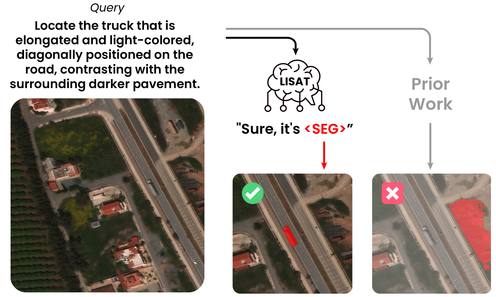

# LISAT: Language-Instructed Segmentation Assistant for Satellite Imagery

This repository provides the official PyTorch source code for our paper:  
**[LISAT: Language-Instructed Segmentation Assistant for Satellite Imagery](https://arxiv.org/abs/2312.08366)**  
🔗 Project page: [https://lisat-bair.github.io/LISAt/](https://lisat-bair.github.io/LISAt/)

**Authors**:  
[Jerome Quenum*](https://jquenum.github.io/), [Wen-Han Hsieh*](https://wen-hanhsieh.github.io/personal_website/), [Tsung-Han Wu](https://tsunghan-wu.github.io/), [Ritwik Gupta](https://ritwikgupta.me/), [Trevor Darrell](https://people.eecs.berkeley.edu/~trevor/), [David M. Chan](https://dchan.cc/)  
(* equal contribution, UC Berkeley)

---

## Introduction

Reading satellite images isn't just about identifying objects—it's about understanding their **context**, **relationships**, and sometimes even the **absurdity** of what humans ask AI to locate.

Enter **LISAT**, your AI-powered geospatial detective, trained to not only recognize but also **reason** about objects in satellite imagery. Whether it’s detecting urban expansion or identifying a suspiciously duck-shaped lake, LISAT delivers intelligent, nuanced segmentation and captioning from satellite views.

### Trained on Two New Datasets:
- **GRES** (Geospatial Reasoning Segmentation):  
  27,615 segmentation annotations over 9,205 images.  
  - [Download on Hugging Face](https://huggingface.co/datasets/jquenum/GRES/blob/main/README.md)  
  - [GitHub Repo](https://github.com/lisat-bair/GRES)

- **PreGRES**:  
  A large-scale multimodal pretraining dataset with over **1 million QA pairs** grounded in satellite imagery.

LISAT outperforms prior models like RS-GPT4V with:
- **+10.04%** improvement in BLEU-4 (image captioning)
- **+143.36%** improvement in gIoU (segmentation)

<p align="center">
  
</p>

---

## Status Update

- **2025-03-22**: Released training, evaluation, demo scripts, pretrained checkpoints, and full datasets.

---

## Installation Guide

### System Requirements
- **OS**: Linux
- **GPU**: NVIDIA A100 recommended (for FlashAttention)
- **Python**: 3.9

### 🔧 Environment Setup

```bash
# Step 1: Create Python environment
conda create -n lisat python=3.9
conda activate lisat

# Step 2: Install dependencies
pip install pybind11==2.11.1
# install torch, torchvision as best fit for your system
pip install -r requirements.txt
pip install flash-attn --no-build-isolation  # Required for FlashAttention

# Step 3: Install evaluation metrics for image-captioning, vqa
# install https://pypi.org/project/pycocoevalcap/
```

## Model & Dataset Release
### LISAT Models on Hugging Face
LISAT-7B is specifically trained for geospatial reasoning segmentation tasks. Below are gIoU & cIoU score of LISAT-7B.

| Model Name | LMM | HG-ckpt URL | gIoU | cIoU  |
|------------|----------------|----------------|----|----|
| LISAt-7B    | LISAT-PRE  | [jquenum/LISAt-7b](https://huggingface.co/jquenum/LISAt-7b) | 27.5 | 24.5 |

LISAT_PRE-7B is specifically trained for geospatial image-captioning & visual question answering tasks. Below are BLEU-4 score of LISAT_PRE-7B.

| Model Name | HG-ckpt URL | UCM-Captions | NWPU-Captions  | Sydney-Captions | Sydney-Captions |
|------------|----------------|----|----|----|----|
| LISAT_PRE-7B | [jquenum/LISAt_PRE-7B](https://huggingface.co/jquenum/LISAt_PRE-7b) | 72.3 | 65.8 | 54.2 | 36.1 |

RemoteCLIP is required for both LISAT-7B, LISAT_PRE-7B: [wen-han/remote_clip_vit_l_14](https://huggingface.co/wen-han/remote_clip_vit_l_14)

### Datasets
Visit our [Dataset page](./dataset/README.md) for more details.
- [GRES Dataset on GitHub](https://github.com/lisat-bair/GRES)  
- [GRES Dataset on Hugging Face](https://huggingface.co/datasets/jquenum/GRES/blob/main/README.md)

---

## Training

```bash
bash train_lisat.sh [ReferSeg or ReasonSeg] [Deepspeed GPU Settings] [MASTERPORT]

# Example:
bash train_lisat.sh ReasonSeg localhost:0,1 15990
```

---

## Merge LoRA Weights

```bash
bash merge_lora_weight.sh
```

---

## Evaluation

### Geospatial Segmentation Evaluation (gIoU, cIoU):

```bash
bash eval_lisat.sh
```

### LISAT Inference for Image Captioning:

```bash
bash pred_lisat_vqa.py
```

### Image Captioning Evaluation (BLEU, ROUGE-L, etc.)

```bash
cd eval_lisat_pre
bash eval_captioning.sh
```

---

## Acknowledgements

LISAT builds upon foundational work from:

- [SESAME](https://github.com/see-say-segment/sesame)  
- [LISA](https://github.com/dvlab-research/LISA)  
- [LLaVA](https://github.com/haotian-liu/LLaVA)  
- [SAM (Segment Anything)](https://github.com/facebookresearch/segment-anything)

We thank the open-source community for its contributions.

## Citation

If you use LISAT, its datasets, or any part of this repository in your work, please consider citing our [paper](https://arxiv.org/pdf/2505.02829):

```bibtex
@article{quenum2025lisat,
  title={LISAT: Language-Instructed Segmentation Assistant for Satellite Imagery},
  author={Quenum, Jerome and Hsieh, Wen-Han and Wu, Tsung-Han and Gupta, Ritwik and Darrell, Trevor and Chan, David M},
  journal={arXiv preprint arXiv:2505.02829},
  year={2025}
}
