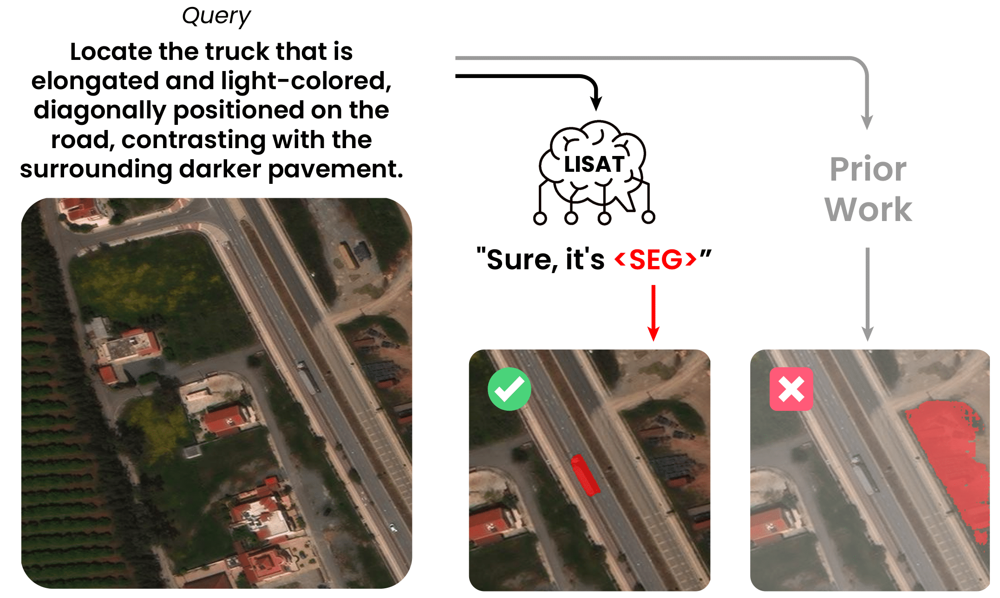

# LISAT: Language-Instructed Segmentation Assistant for Satellite Imagery

This repository provides the official PyTorch source code for our paper:  
**[LISAT: Language-Instructed Segmentation Assistant for Satellite Imagery](https://arxiv.org/abs/2312.08366)**  
🔗 Project page: [https://lisat-bair.github.io/LISAt/](https://lisat-bair.github.io/LISAt/)

**Authors**:  
[Jerome Quenum*](https://people.eecs.berkeley.edu/~jquenum/), [Wen-Han Hsieh*](https://wen-hanhsieh.github.io/personal_website/), [Tsung-Han Wu](https://tsunghan-wu.github.io/), [Ritwik Gupta](https://ritwikgupta.me/), [Trevor Darrell](https://people.eecs.berkeley.edu/~trevor/), [David M. Chan](https://dchan.cc/)  
(* equal contribution, UC Berkeley)

---

## 🚀 Introduction

Reading satellite images isn't just about identifying objects—it's about understanding their **context**, **relationships**, and sometimes even the **absurdity** of what humans ask AI to locate.

Enter **LISAT**, your AI-powered geospatial detective, trained to not only recognize but also **reason** about objects in satellite imagery. Whether it’s detecting urban expansion or identifying a suspiciously duck-shaped lake, LISAT delivers intelligent, nuanced segmentation and captioning from satellite views.

### 🔍 Trained on Two New Datasets:
- **GRES** (Geospatial Reasoning Segmentation):  
  27,615 segmentation annotations over 9,205 images.  
  - 🤗 [Download on Hugging Face](https://huggingface.co/datasets/jquenum/GRES/blob/main/README.md)  
  - 💻 [GitHub Repo](https://github.com/lisat-bair/GRES)

- **PreGRES**:  
  A large-scale multimodal pretraining dataset with over **1 million QA pairs** grounded in satellite imagery.

📈 LISAT outperforms prior models like RS-GPT4V with:
- **+10.04%** improvement in BLEU-4 (image captioning)
- **+143.36%** improvement in gIoU (segmentation)

<p align="center">
  
</p>

---

## 📌 Status Update

- **✅ 2025-03-22**: Released training, evaluation, demo scripts, pretrained checkpoints, and full datasets.

---

## 🛠 Installation Guide

### ✅ System Requirements
- **OS**: Linux
- **GPU**: NVIDIA A100 recommended (for FlashAttention)
- **Python**: 3.9

### 🔧 Environment Setup

```bash
# Step 1: Create Python environment
conda create -n lisat python=3.9
conda activate lisat

# Step 2: Install dependencies
pip install pybind11==2.11.1
# install torch, torchvision as best fit for your system
pip install -r requirements.txt
pip install flash-attn --no-build-isolation  # Required for FlashAttention
```

### 📁 Required Files & Datasets

Ensure the following directories exist:

```
./dataset/                          # # 
./vqa_caption_ans/                 # Captioning ground truths
./captioning_dir/                  # LISAT model predictions
./eval_lisat_pre/pycocoevalcap/    # Captioning evaluation metrics
./llava-v1.5-7b-geollava_remoteclip_merged/   # Base model (LISAT_PRE)
```

---

## 🏋️‍♂️ Training

```bash
bash train_lisat.sh [ReferSeg or ReasonSeg] [Deepspeed GPU Settings] [MASTERPORT]

# Example:
bash train_lisat.sh ReasonSeg localhost:0,1 15990
```

---

## 🔄 Merge LoRA Weights

```bash
bash merge_lora_weight.sh
```

---

## 📊 Evaluation

### Geospatial Segmentation Evaluation (gIoU, cIoU):

```bash
bash eval_lisat.sh
```

### LISAT Inference for Image Captioning:

```bash
bash pred_lisat_vqa.py
```

### Image Captioning Evaluation (BLEU, ROUGE-L, etc.)

```bash
cd eval_lisat_pre
bash eval_captioning.sh
```

---

## 🤗 Pretrained Models & Datasets

### 🧠 LISAT-7B Model on Hugging Face

- [LISAt-7B on Hugging Face](https://huggingface.co/jquenum/LISAt-7b)

### 📦 Datasets

- [📘 GRES Dataset on GitHub](https://github.com/lisat-bair/GRES)  
- [📘 GRES Dataset on Hugging Face](https://huggingface.co/datasets/jquenum/GRES/blob/main/README.md)

---

## 🙏 Acknowledgements

LISAT builds upon foundational work from:

- [SESAME](https://github.com/see-say-segment/sesame)  
- [LISA](https://github.com/dvlab-research/LISA)  
- [LLaVA](https://github.com/haotian-liu/LLaVA)  
- [SAM (Segment Anything)](https://github.com/facebookresearch/segment-anything)

We thank the open-source community for their contributions.

## 🎯 Citation

If you use LISAT, its datasets, or any part of this repository in your work, please consider citing our paper:

```
@article{wenhan2025lisat,
  title={LISAT: Language-Instructed Segmentation Assistant for Satellite Imagery},
  author={Quenum, Jerome and Hsieh, Wen-Han and Wu, Tsung-Han and Gupta, Ritwik and Darrell, Trevor and Chan, David M},
  journal={TBD},
  year={2025}
}
```